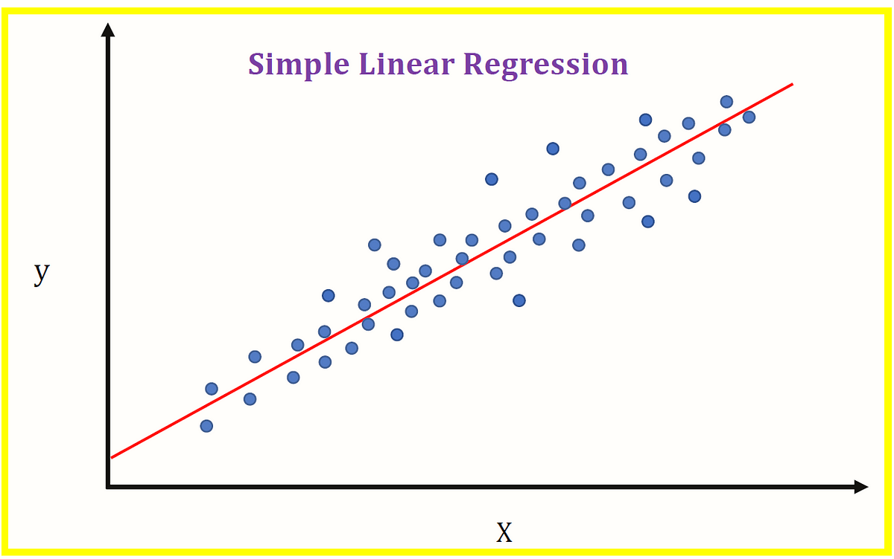

```{r setup, include=FALSE}
knitr::opts_chunk$set(echo = TRUE)
```

## Basic
Linear Regression Model is based on Linear Regression Algorithms that’s applied on data and result on data modelling
AI -> ML -> DL
Linear Regression Algorithm -> Traditional ML or Statistical Learning

All data modelling is mathematical model

Data modelling (Process) -> Data models (Output)

Time frame
Business Objective -> Data Understanding -> EDA (Data Mining) -> Data Modelling

To learn :
   - Linear Regression Algorithm
   - Decission Tree
   - Logistic Regression

## Linear Regression

### Objective 
  - Establish if there is a relationship between 2 variables
     - Talking about a statitstically significant relationship between 2 variables
     - Examples : Imcome and spending (positive), wage and gender (negative), student height and exam scores (no relation)
  - Forecast new observation
     - Can we use the relationship forecast unobserve values
     - Examples : What will be the sales next quarter? 
     
### Variable Roles
  - Dependent Variable 
    - Value we want to explain or forecast
    - variables that it's values depend on something
    - Only 1 in a datasets
    - Usually denoted as "y"
  - Independent Variable 
    - The variable that explain the dependent variable
    - It's values are independent
    - 1 or more in a datasets
    - Usually denoted as "x"
    
Linear Regression is separated into 2 : 

#### Simple Linear Regression -> x and y only 1 variable
Using linear equation : 

  - What we have learn : 
    - y = a + bx 
    - y = mx + b 
  - What we will use 
    - y = β0 + β1x 
    
  - In real life linear regression will akways have a error
    - y = β0 + β1x + ε \
        y = dependent variable \
        x = independent varibale \
        β0= Constant / intercept \
        β1= x coeficient / slope \
        ε = error (to be minimized)
  
  The slope is an intutitive way to predict the expected value of y
  The intercept is not an intuitive way yo predict the expected value of y, as it only works when the slope is 0
      
  If we visualized then it will look like this : 
  
  
##### Confidence Intervals
Estimates will look similar to the true value but will not be the same.
So instead of using 1 estimate, it's better to create a range of estimates called **Confidence Intervals**.
It's the standard to work with 95% Confidence Intervals

do by adding 2x std.error 

###### Statistically Significant Relationship
  - *Rule of Thumb* : If 0 is outside 95% confidence interval, then there's a statistically significant relationship
  - Rejecting the hypothesis that there's no relationship or that 0 is a possible value for the slope
  - We accept there's a relationship
  
###### Statistically Significant Relationship part-2
  - *Rule of Thumb* : If the p-value is below 5% or 0.05 then there's a Statistically Significant Relationship.
  - p-value is basicly the probability of there's no relationship.
  
##### Model Fit
How well the model fit with the reality.
Data model must be evaluated, usually using metrics, classification, regression.

Metrics that can be used : 

  - R^2 = coefficient of determination (the bigger the more it represent the data, but doesn't mean that the model is a good model or not) -> knowing the proportion of the dependent var that's explained by the independent var
  - RSE (Regression Standard Error) : getting the most minimum value (0 - 100),  if R^2 increase then RSE will decrease
  
##### Forecasting
- Use the observed values of the independent variables to forecast unobserved values of the dependent variable
- Making the point forecast.
- report the confidence interval of the forecasted value of the unobserved values. 


```{r}

```

